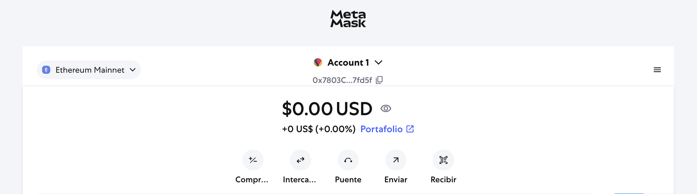
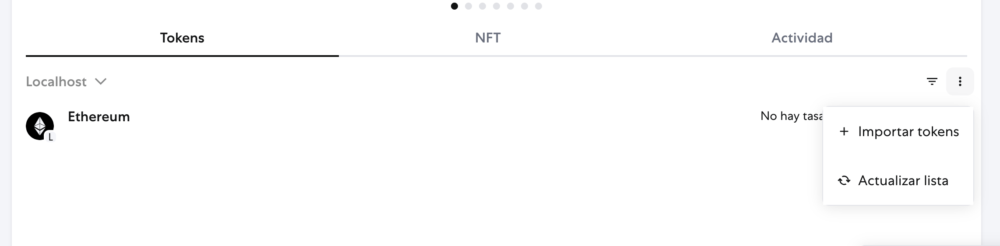
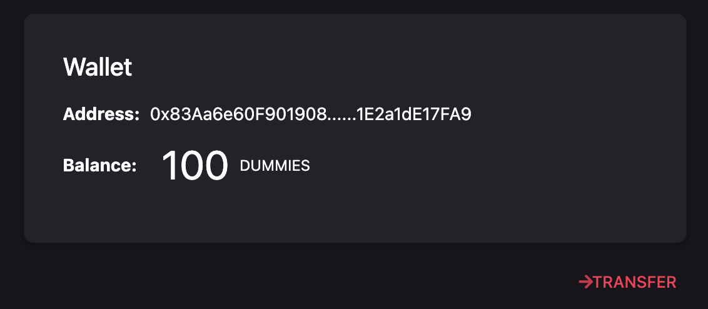

# Ethereum Wallet Dapp

This is a simple **React + Redux-Saga** decentralized application (dApp) that connects to a local Ethereum blockchain, shows your wallet balance, and allows you to transfer **dummy tokens** to another address.

---

## Features

**Wallet Connection**
- Connects to your Ethereum wallet (e.g. MetaMask) running locally.

**Balance Display**
- Shows your ETH balance in your wallet.

**Token Transfers**
- Transfer dummy tokens to any Ethereum address.

**Transaction Feedback**
- Displays transaction hash for successful transfers.
- Copy transaction hash to clipboard with one click.

**Routing**
- Built with `react-router-dom` for page navigation.

**State Management**
- Uses Redux + Redux-Saga for clean state handling and async flows.

---

## How to Setup the App Locally

Below are the detailed steps to:

1. Spin up a local Ethereum network
2. Deploy your dummy token
3. Run the React app

---

## 1. Install Node & Dependencies

Make sure you have:

- Node.js ≥ 16.x
- npm ≥ 8.x

---

## 2. Start a Local Ethereum Network

2.1. Install **Hardhat** globally:
```bash
npm install -g hardhat
```

2.2. Clone [this](https://github.com/decentraland/dummy-token) repo.
```bash
git clone https://github.com/decentraland/dummy-token
```
2.3. Install dependencies

```bash
npm install
```
2.4. Run tests
```bash
npx hardhat test
```

2.5. Start the local development Ethereum node.
```bash
npx hardhat node --hostname 0.0.0.0
```
👆 KEEP IT RUNNING! 👆

2.6. Deploy the Dummy Token contract. keep note of the `Token Address` that will output in the terminal
```bash
npx hardhat --network localhost run scripts/deploy.js
````
This will be the result and you will use "Token Address"
```
Deploying contracts with the account: 0xf39Fd6e51aad88F6F4ce6aB8827279cffFb92266
Account Balance: 10000000000000000000000
Token Address: 0x5FbDB2315678afecb367f032d93F642f64180aa3
```

---
## 3. Install Metamask extention

We need a Metamask [Google Chrome Extension](https://chromewebstore.google.com/detail/metamask/nkbihfbeogaeaoehlefnkodbefgpgknn) to work and test locally.

***Considetations***

You don't need to secure the account you are creating, remember this is all fake and for testing

First Metamask extension screen.



3.1. Connect Metamask to Local Network (The localhost server running from step 2.5)

On the left top corner click on the dropdown "Ethereum Mainnet" and then on the bottom click "Add Custom Network".
Then you will get a form to full fill.

````
Network Name: Localhost
New RPC URL: http://0.0.0.0:8545    // remember to use 0.0.0.0 and not localhost
Chain ID: 1337
Currency Symbol: ETH

Save and switch to this network
````

3.2. Time to fund your Ethereum account with ETH and mint DUMMY tokens.
Replace <token-address> with Token Address obtained in step 2.6 and replace <your-address> with the Meta Mask address (copy the Account 1 hash)
```bash
npx hardhat --network localhost faucet <token-address> <your-address>
```
Now you should see on Ethereum token with 1ETH.

Add the Dummy Token to Meta Mask tokens.



Click Import Tokens and select Localhost for the Network and use the Token Address obtained in step 2.6


## 4. Start React App

4.1. Create `.env` file:
```bash
cp .env.example .env
```
4.2. Complete the VITE_TOKEN_ADDRESS with Token Address obtained in step 2.6
```
VITE_TOKEN_ADDRESS=<token-address>
```
4.3. Install dependencies
```bash
npm install
```
4.4. Start the App
```bash
npm run start
```

Visit:

```
http://localhost:5173
```

The app will connect to your local Ethereum node!



---

## 🙏 Final Words

Thanks for checking out this project!

This app is a simple example showing how to connect a React frontend to the Ethereum blockchain. Whether you're experimenting with local networks like Hardhat or planning to deploy to testnets, this dApp is a great starting point.

Feel free to fork, contribute, or adapt it for your own blockchain projects. Happy coding and building on Web3!

reyesdiego@hotmail.com

---